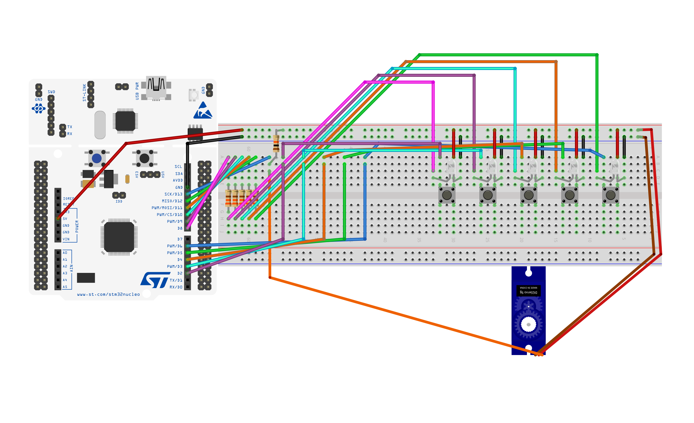

# A C++ Whack-a-Mole Game
## A fun Whack-a-Mole game using a Nucleo-G071RB microcontroller and Uno R3 project starter kit

[Please see this short summary of the hardware settup and the development process](Whack-a-mole_Overview.pdf)

